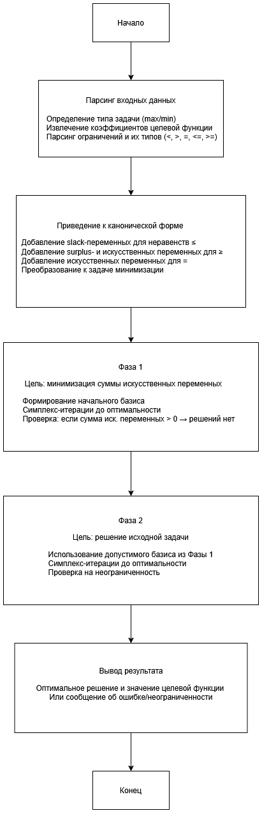
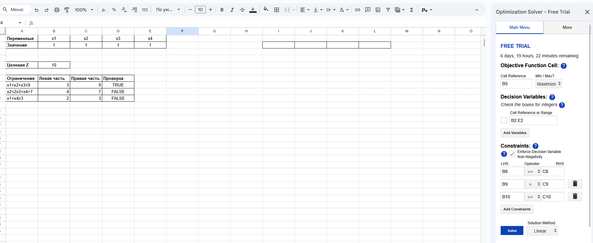
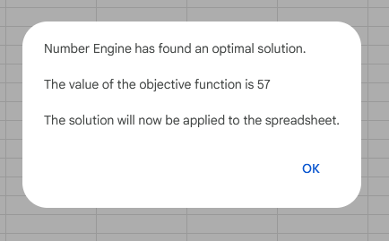
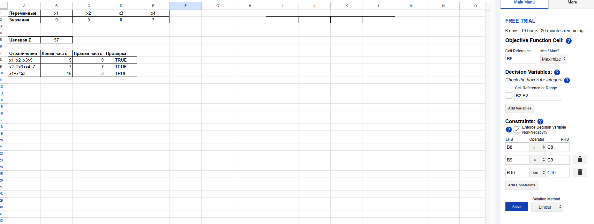

# Задание №1. Разработка программного обеспечения для решения задачи линейного программирования


Задание по теме «Решение задач линейного программирование»

В рамках данной работы вы закрепите навыки работы с математической постановкой задачи линейного программирования, получения из нее допустимого канонического вида и ее решения с помощью симплекс-метода. Также усилите компетенции в области математического программирования, когда будете реализовывать решение ЗЛП в языке программирования высокого уровня.


Что дано на входе?

Общая задача линейного программирования – математическая запись: целевая функций (он же критерий эффективности); ограничения.


Что необходимо сделать?

Необходимо реализовать компьютерную программу на языке высокого уровня (Python или эквивалентный), которая будет решать ЗЛП (полный цикл), выполняя следующие основные шаги:

    Считывание текстового файла с файла с постановкой ЗЛП (формат файла - на ваше усмотрение).
    Приведение задачу к каноническому виду.
    Формирование вспомогательной задачи.
    Решение вспомогательную задачу.
    Переход к основной задаче (если есть возможность).
    Решение основную задачу.
    Запись ответа в форме: оптимальная точка , значение целевой функции в оптимальной точке:  или информацию, что решений нет, указав причину.

Необходимо продемонстрировать работу программы на примере согласно варианта общей ЗЛП, сравнивание ответ с тем ответом, который даст MS Excel с помощью надстройки "поиск решения".

## Краткое описание алгоритма решения ЗЛП
## Блок-схема алгоритма



## Инструкция - как развернуть и запустить программу

Требования к системе:

- Python 3.7 или выше
- Библиотека NumPy

Установка библиотеки:

```pip install numpy```

### Целевая функция
**Максимизировать:**
Z = 4x₁ + x₂ + 2x₃ + 3x₄

### Ограничения

x₁ + x₂ + x₃ ≤ 9

x₂ + 2x₃ + x₄ = 7

x₁ + x₄ ≥ 3

В функции create_problem_file напишите целевую функцию и ограничения, после чего будет создан файл problem.txt

Запустите [программу](main.py):
```python main.py```

Результат работы можно посмотреть [здесь](result.txt)

Сравним с вариантом решения задачи через таблицы с помощью надстройки "поиск решения"

В Google Sheets я установил дополнение Optimization Solver

Пусть стартовая точка будет 1



Получаем максимальное значение: 



После чего обновляется оптимальная точка



## Выводы

Таким образом можно отметить, что алгоритм демонстрирует эффективность двухфазного симплекс-метода для задач с ограничениями-равенствами и обеспечивает нахождение оптимума. 